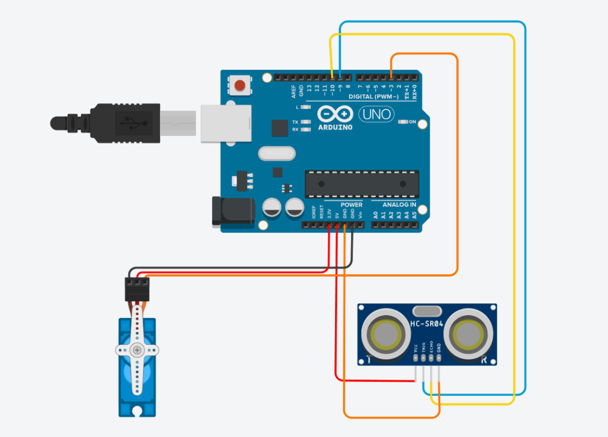

# 🗑️ Tempat Sampah Otomatis dengan Arduino

Proyek ini bertujuan untuk membuat tempat sampah yang dapat membuka dan menutup tutupnya secara otomatis menggunakan sensor ultrasonik dan motor servo. Ketika tangan atau objek terdeteksi dalam jarak tertentu, tutup tempat sampah akan terbuka secara otomatis dan menutup kembali setelah beberapa detik.

---

## 📦 Komponen yang Dibutuhkan

- Arduino Uno
- Sensor Ultrasonik HC-SR04
- Servo Motor SG90
- Kabel Jumper
- Sumber daya (USB / baterai 9V)

---

## 🔌 Wiring Diagram

### Sensor Ultrasonik HC-SR04
- VCC → 5V Arduino  
- GND → GND Arduino  
- Trig → Pin 9 Arduino  
- Echo → Pin 8 Arduino  

### Servo Motor SG90
- VCC (Merah) → 5V Arduino  
- GND (Coklat) → GND Arduino  
- Signal (Oranye) → Pin 3 Arduino  
